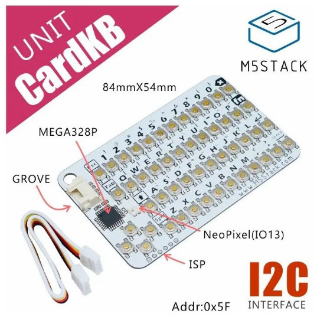
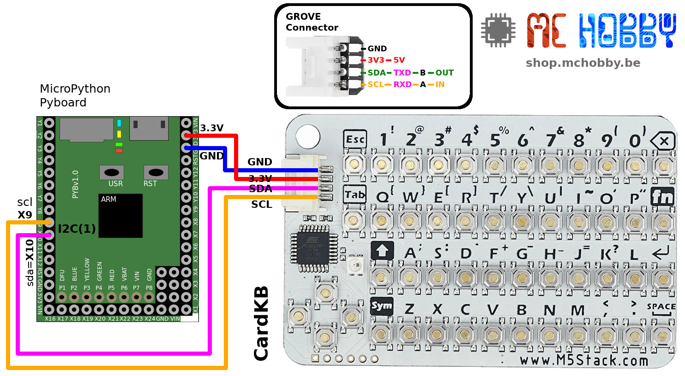
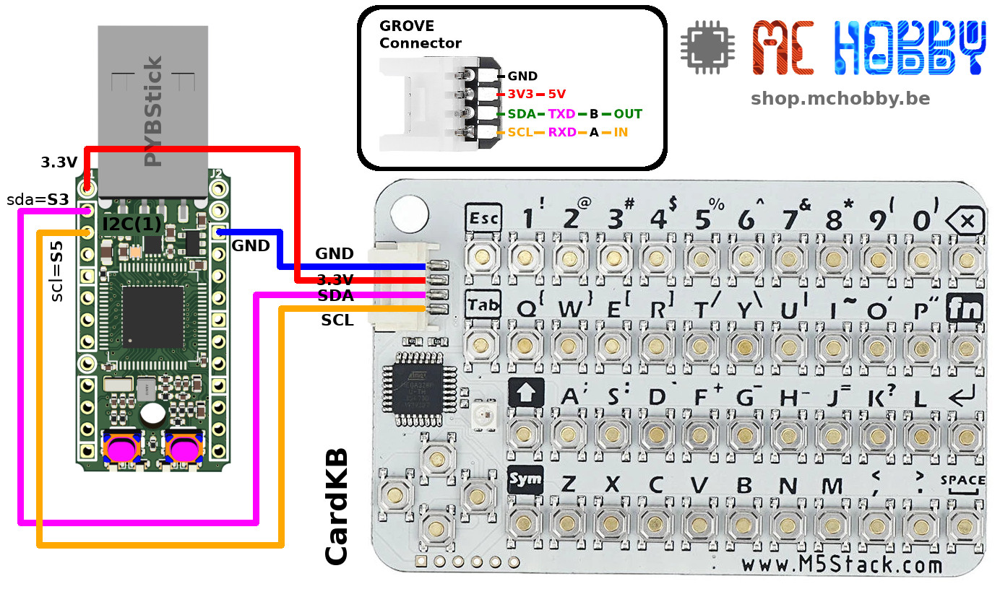

# CardKB: A mini I2C Qwerty Keyboard for M5Stack under MicroPython

CardKB is a full featured mini keyboard that can be connected to the I2C bus of your favorite MicroControler.



Initially designed by M5Stack for its M5-Core and expose a [Groove connector](https://shop.mchobby.be/fr/154-grove) to ease the wiring on the M5-Core.

__Remarks:__
This driver is sourced from [esp8266-upy GitHub](https://github.com/mchobby/esp8266-upy) maintained by [MCHobby](http://shop.mchobby.be)

# Wiring

## Wiring on M5Stack

To use a product on [M5Stack](https://shop.mchobby.be/fr/153-m5stack-esp), you just need to plug it on the Grove connector (I2C, red).

It is also possible to use this keyboard with other MicroPython board by making the appropriate wiring as described here below.

Using a [Grove to Pin connector](https://shop.mchobby.be/fr/m5stack-esp/1929-connecteur-grove-vers-broches-5pcs-3232100019294-m5stack.html) will help a lot.

## Wiring on the Pyboard

Here to wire the keyboard on the [MicroPython Pyboard](https://shop.mchobby.be/fr/56-micropython) board.



## Wiring on PYBStick

Here how to wire the keyboard on the [PYBStick](https://shop.mchobby.be/fr/recherche?controller=search&orderby=position&orderway=desc&search_query=PYBStick&submit_search=) board.



# Test it

Prior to use the examples described here below, you will need to copy the [`lib/cardkb.py`](lib/cardkb.py) library on the MicroPython board.

## read_char

The [`test_char.py`](examples/test_char.py) example rely on the `CardKB.read_char()` method to capture the last key pressed on the keyboard (also includes control char like carriage return, escape, ...).

This __basic method__ filter any of the data if it does not match a known ASCII char (it concentrate efforts displayable chars). To have a fine control on the input keys, we recommend to check the next example.

```
from machine import I2C
from cardkb import *

# Pyboard : X10=sda, X9=scl
# PYBStick: S3=sda, S5=scl
i2c = I2C(1)
# M5Stack : Grove connector - reduced speed needed
# i2c = I2C(freq=100000, sda=21, scl=22)

keyb = CardKB( i2c )

s = ''
while True:
	ch = keyb.read_char( wait=True ) # wait a key to be pressed
	if ord(ch) == RETURN:
		print( 'Return pressed! Blank string')
		s = ''
	elif ord(ch) == BACKSPACE:
		s = s[:-1] # remove the last char
	else:
		s = s + ch # add the char to the string
	print( s )
```

Which produce the following results in the REPL session when keys are pressed on the keyboard

```
>>> import test_char
e
en
enc
enco
encod
encode
encode
encode u
encode un
encode u
encode
encode a
encode a
encode a s
encode a st
encode a str
encode a stri
encode a strin
encode a string
Return pressed! Blank string

h
he
hel
hell
hello
```

## read_key

The [`test_readkey.py`](examples/test_readkey.py) example uses the `CardKB.read_key()` method returning a `(keycode, ascii/None, modifier)` tuple with:
* __keycode__ : the code of the pressed key. The `CardKB.is_ctrl()` method detect if the char is a control char Carriage Return, Backspace, Esc, etc.
* __ascii__ : ASCII char (as possible) matching the pressed key. Warning: the return key does return a true Carriage Return char. Note that `test_readkey.py` example substitute the control char with a human readeable string.
* __modifier__ : detect if the SYM (Symbol) key or FN (Function) key is pressed.

```
from machine import I2C
from cardkb import *

# Pyboard : X10=sda, X9=scl
# PYBStick: S3=sda, S5=scl
i2c = I2C(1)
# M5Stack : Connecteur Grove - réduire la vitesse est nécessaire
# i2c = I2C(freq=100000, sda=21, scl=22)

keyb = CardKB( i2c )

MOD_TEXT = { MOD_NONE : 'none', MOD_SYM : 'SYMBOL', MOD_FN : 'FUNCTION'}
CTRL_NAME = {0xB5:'UP',0xB4:'LEFT',0xB6:'DOWN',0xB7:'RIGHT',0x1B:'ESC',0x09:'TAB',0x08:'BS',0x7F:'DEL',0x0D:'CR'}

print( 'Keycode | Ascii | Modifier' )
print( '---------------------------')
while True:
	keycode,ascii,modifier = keyb.read_key()

	# No key pressed = nothing to display
	if keycode == None:
		continue

	# The control key can't be displayed safely.
	# So try to replace the control char with readable label
	if keyb.is_ctrl( keycode ):
		if keycode in CTRL_NAME:
			ascii = CTRL_NAME[keycode]
		else: # we do not know the name for that KeyCode
			ascii = 'ctrl' # so we replace it with "ctrl" string

	# Display the Key Code, the char and modifier key (if it applies)
	print( "  %5s | %5s | %s" %(hex(keycode), ascii, MOD_TEXT[modifier]) )

```

Which produce the following results:

```
>>> import test_readkey
Keycode | Ascii | Modifier
---------------------------
   0xb5 |    UP | none
   0xb6 |  DOWN | none
   0xb4 |  LEFT | none
   0xb7 | RIGHT | none
   0xb7 | RIGHT | none
   0xb7 | RIGHT | FUNCTION
   0xb7 | RIGHT | none
   0x71 |     q | none
   0x77 |     w | none
   0x65 |     e | none
   0x85 |  None | FUNCTION
   0x35 |     5 | none
   0x50 |     P | none
   0x22 |     " | SYMBOL
   0x1b |   ESC | none
   0x1b |   ESC | none
   0x1b |   ESC | none
   0x80 |  None | FUNCTION
    0x8 |    BS | none
   0x7f |   DEL | none
   0x20 |       | none
   0xaf |  None | FUNCTION
```
